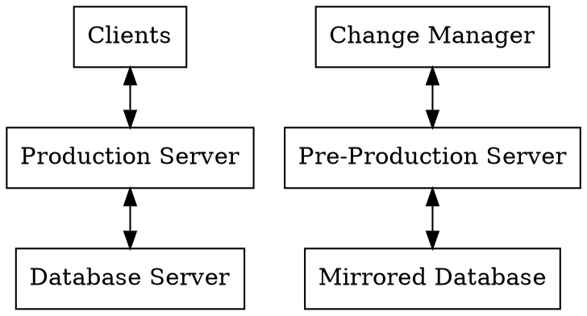

## Definitions

* IC    - Insurance Commision
* MVC   - model-view-controller architecture
* REST  - representational state transfer architecture
* MySQL - most popular database for the web
* MariaDB   - open-source version of MySQL
* PostgreSQL    - open-source database with the most features
* Aurora MySQL  - Amazon's improved version of MySQL
* RDMS  - relational database management system
* IS    - information system
* Client    - computer trying to access the server
* Server    - computer servicing Client requests
* Laravel   - PHP based web development framework
* PHP   - most popular web scripting language
* Web App   - web-based application software
* Business Logic  - enforces the routes and the methods by which business objects are accessed and updated
* PAAS  - platform as a service
* AWS   - Amazon Web Services cloud provider
* IAAS  - infrastructure as a service
* Amazon S3     - AWS Simple Storage Service
* API   - application program interface

# Introduction

## Audience

There are three main audiences for this document. The first would be the implementing technical team that would be composed of the developers, testers and analysts who will implement the software system. The second group would be the IC I.T. team who would be in charge of hosting and deploying the system. Lastly, this document is also for the I.S. team tasked in software support, enhancement and maintenance.  

## Purpose

The Insurance Commission (IC) desires to have data-driven information system software that is accessible to everyone in need of the data parked there.

The IC desires to have their system equipped with a high level of maintainability. It also requires a high flexibility in adding functionality.

IC desires the ability to integrate current stand-alone web applications as well as future developments with respect to data exchange and secure access. 

This document describes a design for a Web Application (Web App) that aligns to the desires of IC in realizing an information system that will support them as IC moves to whole new level of public service.

## Assessment

Throughout the interview stage of the project, I have assessed several needs and opportunities that drive design. Listed here are points of note and how I believe we can use them as guidance for the development stage.

The current development man-power of IC is not so large. It will then benefit enormously from having the ability to split roles in project among in-house and third-party developers. The MVC architecture has good role-splitting  mechanism (e.g. frontend views, backend controller). 

The information system needs of IC is large. It will force the files to be split into many logical directories. Since no single developer can claim his logic is better than all the rest, we recommend following a framework so that all system developers, current or future, will know where each type of file will be found. The Laravel framework has a good directory structure, which is similar to other popular frameworks such as Rails. 

Policy changes seem to be a fairly regular occurence in IC. It would be great if End-Users confident that particular link will give them what they need and failing that, will return empty and not give them anything else that may cause confusion. It would be great if End-users are confident that new features will mean new links and would simply expect those to be available in response to policy. These benefits are part of implementing a RESTful architecture pattern through the uniform interface constraint. 

There would be two (2) main environements for system usage. The first is within the IC for data access needs in support of analysis and reportorial requirements. The second environment in insurance companies, as a means to submit data and obtain feedback from IC.

The users for the first environment are IC staff for data access and report generation and IC heads for report consumption. The users for the second environement are the insurance company staff to prepare and update requirements as draft submissions and the insurance company head to authorize submissions.

The system is for having a central repository of files and data for IC interaction with insurance companies. 

The main functions are secure login to a centralized data-driven web application that allows access to resources depending on the user rights of their IC staff or insurance company staff. Part of the resources are soft copies of the submissions to IC (i.e requests, schedules and reports).

The main interfaces are a insurance company interface and an IC interface per division. The main inputs to the system are the various required from insurance companies. The main outputs of the system are support for the reports that IC generates. 

# Architecture

The relevant architectures used in this design are 
1. Client-Server 
2. Model-View-Controller (MVC)
3. Representational State Transfer (REST)
4. Active Record Architectural Pattern

These software architecture patterns are compatible with each other when the development is done in a certain way, which are described more throughout this document. 

I recommend one of the following actions to better ensure that the overall architecture is followed, that key patterns implemented consistent with each other and the benefits on reliability, scalability, security and maintainability are achieved for IC. 

Please choose 1:
1. Get the same team who designed to develop the system
2. Get at least part of the design team to be part of the development team
3. Take a software architect from the design team as design consultant in the development phase and resolve each development obstacle inkeeping with the principles of the architecture
4. Make sure that a software architect, who understands the design, guides the development and inspects if the architectural constraints in the design document are observed.

This is like in making a building. Every great and large building has an architect all the way from its start to the end. 

The basic architectdure will look like this:

 

(https://medium.freecodecamp.org/understanding-the-basics-of-ruby-on-rails-http-mvc-and-routes-359b8d809c7a)

## Client-Server Pattern

The services are provided by the server. The server, whether on-premise or in-cloud, will be provisioned and maintained with standard performance parameters of within ~70 percent of average capacity for bandwith, memory and processing. The clients will be nodes within the network with applicable access rights. The server actions in response to logged client requests.

## Model-View-Controller

All requests from clients to the server will be brought to the controller to be preprocessed and routed to the proper action. The controller will direct the actions to the Model when database access is necessary and direct it to the Views when the data requirements are satisfied. 

Every service that the server provides are in terms of actions/ methods for a particular Controller. The default means of output or feedback is through Views that correspond to the actions in the Controller. These controllers may have corresponding Models if they have need to access the database. The Models contain the relationship among the tables in the database. They provide access to database table rows as class instances. The provide access to the fields of a table as object properties.

In this manner, it would be possible to change the underlying relational database management system without altering the base code. The clients can also change web browsers or web-browsing devices without affecting the services rendered by the system.

I agree with the advantages of using MySQL or MariaDB initially to maximize compatibility with most of the databases used in IC. I recommend that  Aurora MySQL RDMS be used when moving operations into the cloud. I also recommend a migration to the PostgreSQL database at some point prior to developing the part of workflow automation where a lot of computation will be necessary. MySQL is best for text heavy databases such as blogs and websites. PostgreSQL tends to excel more for Information Systems (IS). 

MVC allows a degree of separation between the front end of the system and its backend. This will be especially be useful when aesthetics and usability improvements are desired while making sure that the underlying data and logic are kept safe during the implementation of the changes. 

We recommend the MVC framework Laravel for the purpose of IC, where there are I.S. division already has skills in the underlying technologies of the framework and will find it easy to adapt. I recommend switching all development to a framework as soon as possible to make all the resulting systems more scalable, maintainable and future-proof. 

## REST Pattern

Implementing the web application using the framework of Representational State Transfer maximizes scalability of multi-developer multi-group contribution and access. It makes the system resilient with respect to changes in the services requested by the Clients , while having the Server keep assumptions about Clients at a minimum.

The REST patternv allows expansion in complexity through adding layers between the Client and the Server with each layer only interacting with the one immediately above or below it. This makes it easier for the system to work with proxy servers and network gateways.

The REST patterns imposes some other important constraints such as being stateless and having a uniform interface. Using Laravel's resource controller route allows automatically generated and thus, uniform interfaces, so that other developers can safely and easily request for server resources. This will allow multiple IC or non-IC developers to work on a single project together. This will also allow future developers to continue the work of former developers that may have left the service of IC. 

It is important to keep in mind that all requests must be sending a representation of what is required and not commands to the server. The server will still have the ability to ignore or serve the request. Also, the server can send hypermedia, or invitations to access other services or resources from the server. The server provide or push any unrequested service to the Client. What this will do for the UP-IC FEDS is to allow safe addition and removal of features during run time. New or enhanced features will not interfere with current usage without the explicit request for their use. Also, when old features are retired, the server can safely catch any request towards those features and handle them appropriately since the Client cannot directly command the Server. 

## Active Record Architectural Pattern

We recommend that the Active Record Pattern be used as the approach for accessing database data in IC.

In this pattern, each Table of View is mapped into a class. Each instance of the class gets mapped into a row of the Table. There is automatic syncing. New ORM objects are saved in the database. Existing objects are loaded from the database. Changes to object properties are reflected as updates to the database. Finally, when objects are deleted, corresponding rows in the database are destroyed. 

Objects have methods for Insert, Update and Delete. Calls to object properties give the data. Foreign key relationships for joined Tables are used by having one object accessed through a property of another object.

By using Laravel's ORM Model and not directly accessing the database through SQL statements, the Active Record Architecture can be enforced. IC will then have the ability to easily move to other databases in the future such as PostgreSQL and even other proprietary database management systems. 

Using this architecture pattern also has other benefits such as enforcing constraints in linked data deletion, protecting your dependent data against accidental deletion.

# Process and Workflow

The processes per Division with their corresponding designs are listed separately. Please proceed to that section to see descriptions of the designs that adhere to the architecture stated herein.  

Common workflows among processes include User Administration, Data Monitoring and Transaction Audit. Specific processes have dataflow diagrams.

# Environment and Network

The following Evironment diagram can be supported by the Heroku PAAS on top of the AWS cloud service. This is what I recommend for the next phase of development.

The current on-premise servers in IC also capable of hosting the servers according to the diagram.

The software is recommended to be initially cloud developed with the choice of moving on-premise after development. This will allow maximum flexibility in efficient adding of security and reliability to the system during development that can more-readily be translated to on-premise at a future point.  

Development and Testing will be done on local machines and not on the server.

# Deployment View

I suggest to use a Platform as a Service (PAAS) for the first deployment of the system. This is a middle layer to Cloud Infrastructure. 

Spefically, I suggest using Heroku PAAS that is built on top of the AWS cloud. I find this as a best-practice intermediate step going to a direct cloud Infrastructure as a Service.

For file storage, we recommend the AWS Simple Storage Service (S3) for the security and reliability it provides. It also has a stable and well developed API for use with the recommended framework.

By doing the above, we will be able to capture, real-time bandwith, redundancy and security requirements for the system that will guide any future deployment and expansion.

# Implementation View

We recommend a Git-based source code version control. Examples of which are Gitlab, Bitbucket and Github. This can be hosted by IC once a stable version 1.0 of the system is released. For initial development, the code is recommended to be stored in a private cloud-based repository. 

We recommend month-long agile sprints as a development methodology for implementing this design over a 9-12 month period. 

## Data Management

Data conversion and migration would be through Excel or similar spreadsheets and SQL databases. Archiving data will be through database backups and secure cloud-based storage.

## Security Authentication Authorization and Audit

Authentication would be through login accounts set per division or per insurance company access rights. 

Authorization would on the company side, would rely on the accoount given to the company head. Authorization on the IC side may be designated to each Division Head for each division. Deputy Commissioners would have authority over all their divisions. 

All actions will be logged by the system. For actions that impact the database, the logs will include enough data to reverse the change being done.

# References

Martin Fowler. 2003. Patterns of Enterprise Application Architecture. Book

Roy Thomas Fielding. 2000. Architectural Styles and the Design of Network-based Software Architectures. UNIVERSITY OF CALIFORNIA,
IRVINE. DISSERTATION